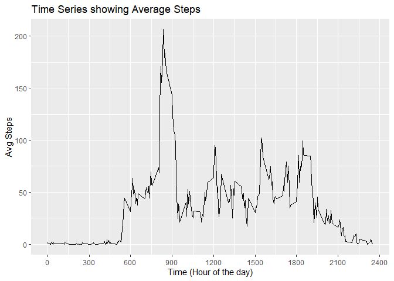

## Introduction

Now, it is possible to collect a large amount of data about personal movement using activity monitoring devices such as a Fitbit, Nike Fuelband, or Jawbone Up. These type of devices are part of the “quantified self” movement – a group of enthusiasts who take measurements about themselves regularly to improve their health, to find patterns in their behavior, or because they are tech geeks. But these data remain under-utilized both because the raw data are hard to obtain and there is a lack of statistical methods and software for processing and interpreting the data.

This assignment makes use of data from a personal activity monitoring device. This device collects data at 5 minute intervals through out the day. The data consists of two months of data from an anonymous individual collected during the months of October and November, 2012 and include the number of steps taken in 5 minute intervals each day.


```r
library(ggplot2)
library(lubridate)
```

```
## 
## Attaching package: 'lubridate'
```

```
## The following objects are masked from 'package:base':
## 
##     date, intersect, setdiff, union
```

## Loading and preprocessing the data


```r
sourceURL <- 'https://d396qusza40orc.cloudfront.net/repdata%2Fdata%2Factivity.zip'
destFile  <-  paste(getwd(),"Factivity.zip",sep = "/")
download.file(sourceURL, destFile)
unzip(destFile)

activityDF <- read.csv('activity.csv')
dim(activityDF)
```

```
## [1] 17568     3
```

```r
names(activityDF)
```

```
## [1] "steps"    "date"     "interval"
```

## What is mean total number of steps taken per day?


```r
daywise <- as.data.frame(xtabs(steps ~ date, activityDF, drop.unused.levels = TRUE))
names(daywise) <- c('date', 'totalsteps')
```

1) Total Number of steps taken per day


```r
sum(daywise$totalsteps)
```

```
## [1] 570608
```

2) Histogram of total number of steps taken per day


```r
ggplot(daywise, aes(x = totalsteps)) +  
      labs(title ="Histogram of Total Steps", x = "Total Number of Steps", y = "Count") +
      geom_histogram(binwidth = 2000, fill = "white", color = "black") +
      geom_vline(aes(xintercept=mean(totalsteps)), color="blue", linetype="dashed")
```

<!-- -->

3) Distribution of Total Steps with Mean and Median values


```r
summary(daywise$totalsteps)
```

```
##    Min. 1st Qu.  Median    Mean 3rd Qu.    Max. 
##      41    8841   10765   10766   13294   21194
```

## What is the average daily activity pattern?


```r
completeactivity <- activityDF[complete.cases(activityDF$steps) == TRUE,]

intwise <- aggregate(completeactivity$steps,
                     by = list(completeactivity$interval),
                     FUN = 'mean', drop = TRUE)

names(intwise) <- c('interval', 'avgsteps')
```

1) Make a time series plot


```r
ggplot(intwise, aes(x = interval, y = avgsteps)) + 
  scale_x_continuous(breaks = seq(0,2400, by = 300)) +
  labs(title='Time Series showing Average Steps', x = 'Time (Hour of the day)', y = 'Avg Steps') +
  geom_line()
```

<!-- -->

2) Which 5-minute interval, on average across all the days in the dataset, contains the maximum number of steps?


```r
intwise[which.max(intwise$avgsteps),]
```

```
##     interval avgsteps
## 104      835 206.1698
```

## Imputing missing values

1) Calculate and report the total number of missing values in the dataset (i.e. the total number of rows with NAs)


```r
nrow(activityDF[!complete.cases(activityDF$steps),])
```

```
## [1] 2304
```
2) Fill in missing values in the dataset using median values of the interval;


```r
intmedian <- aggregate(completeactivity$steps, by = list(completeactivity$interval),
             FUN = 'median', drop = TRUE)
names(intmedian) <- c('interval', 'avgsteps')

missing <- activityDF[is.na(activityDF$steps),]
nonmissing <- activityDF[!is.na(activityDF$steps),]

fillmedian <- merge(missing, intmedian, by.x = 'interval', by.y = 'interval', all.x)
fillmedian <- fillmedian[,-2]    #  remove the column with NA values
names(fillmedian) <- c('interval', 'date', 'steps')
```

3) Create new dataset equal to original dataset with missing data filled in


```r
imputed <- rbind(fillmedian, nonmissing)
imputed <- imputed[order(imputed$date, imputed$interval),]

# Check for missing values in imputed dataset
nrow(imputed[is.na(imputed$steps),])
```

```
## [1] 0
```

4) Build Histogram using dataset with Imputed values


```r
idaywise <- as.data.frame(xtabs(steps ~ date, imputed, drop.unused.levels = TRUE))
names(idaywise) <- c('date', 'totalsteps')

ggplot(idaywise, aes(x = totalsteps)) +  
      labs(title ="Histogram of Total Steps", x = "Total Number of Steps", y = "Count") +
      geom_histogram(binwidth = 2000, fill = "white", color = "black") +
      geom_vline(aes(xintercept=mean(totalsteps)), color="blue", linetype="dashed")
```

<!-- -->


```r
df <- as.data.frame(cbind(summary(daywise$totalsteps),summary(idaywise$totalsteps)))
names(df) <- c('Dataset as-is', 'Dataset Imputed')
df
```

```
##         Dataset as-is Dataset Imputed
## Min.            41.00          41.000
## 1st Qu.       8841.00        6778.000
## Median       10765.00       10395.000
## Mean         10766.19        9503.869
## 3rd Qu.      13294.00       12811.000
## Max.         21194.00       21194.000
```

## Are there differences in pattern between weekdays and weekends


```r
imputed$weekdays <- wday(as.Date(imputed$date))

imputed[imputed$weekdays %in% c(2:6),4] <- 0    #  Weekdays - Mon - Friday
imputed[imputed$weekdays %in% c(7,1),4] <- 1    #  Weekends - Sat,Sun

weekdwise <- aggregate(cbind(steps) ~ interval + weekdays, data = imputed ,mean)

ggplot(weekdwise, aes(x = interval, y = steps)) +
  scale_x_continuous(breaks = seq(0,2400, by = 300)) +
  labs(x = 'Time (Hour of the day)', y = 'Avg Steps') +
  geom_line() +
  facet_grid(weekdays ~., 
             labeller=as_labeller(c("0" = 'Weekdays', "1" = 'Weekends')))
```

<!-- -->

## End
